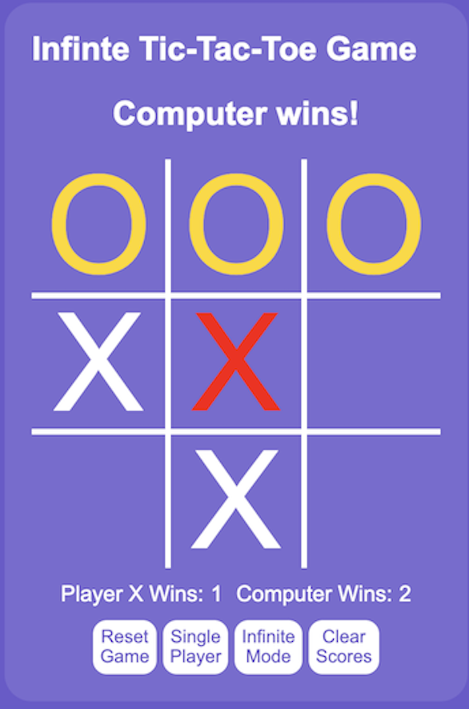
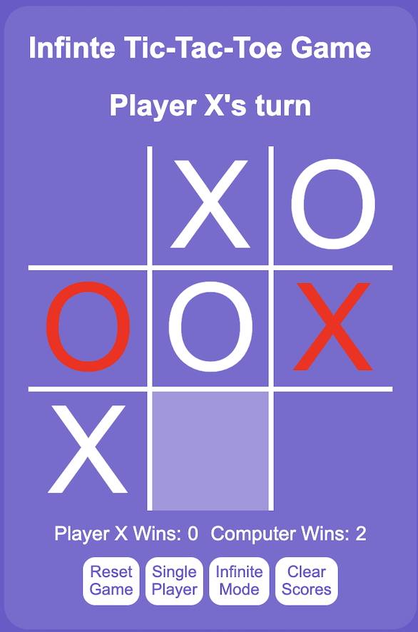
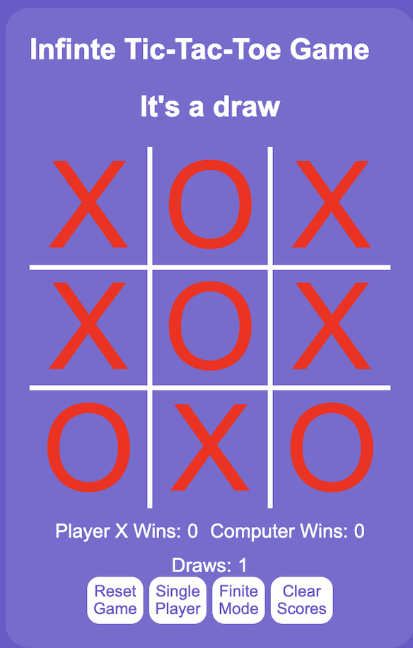
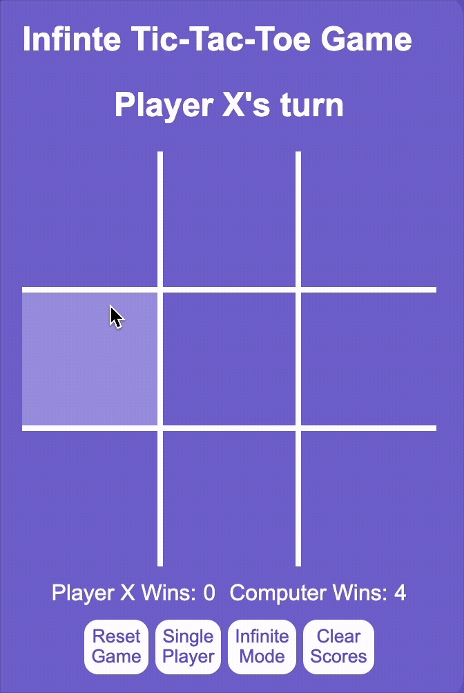

## Infinite Tic-Tac-Toe
A new way to play Tic-Tac-Toe with a dynamic “infinite play” mechanic and AI ran with Alpha-Beta Pruning and Minimax

## Overview 
**Infinite Tic-Tac-Toe** introduces a unique twist to the classic game:
-   Each player can only have **3 pieces** on the board at once
-   When the **4th piece** is placed the  **oldest move is removed automatically**

## Features 
- **Infinite or Classic Mode**
  - Oldest move disappears after placing a 4th piece
  - Prevents draws and keeps gameplay continuous
  - Switch from infinite mode to standard Tic-Tac-Toe

- **Single & Two Player Modes**
  - Play against both AI or another player locally

- **Score Tracking**
  - Tracks wins, AI wins and draws
  - Ability to clear scores
  - Score is also cleared when modes are switched 

- **Modular Architecture**
  - Clean separation of logic, UI, and state using ES6 modules

- **Desktop App**
  - Packaged as a standalone desktop application
    
## Play the Prebuilt Mac App
Download here:https://github.com/JosephGarcia98/Infinite-Tic-Tac-Toe/releases/tag/v1.0.0

## Play Live Demo   
This project uses Electron, so it cannot be run directly in the browser      
Here is a web based verion with all the features: https://josephgarcia98.github.io/Infinite-Tic-Tac-Toe-demo/
    
## Images




## Watchable Demo


## AI Implementation
The AI is implemented using **Minimax algorithm with Alpha-Beta Pruning**
  
### How it Works 
- The AI explores possible game states using a **recursive game tree**
- It simulates both players:
  - **Max player (AI - "O")** to maximizes the score
  - **Min player (Human - "X")** to minimizes the score
  - Uses **Alpha-Beta Pruning** to skip evaluating branches that cannot affect the final decision, improving performance

### Core Logic
- **`minimaxDecision(board)`**
  - Iterates through all valid moves
  - Simulates each possible AI move
  - Calls recursive evaluation functions
  - Selects the move with the highest score

- **`maxValue(board, alpha, beta)`**
  - Simulates the AI’s turn ("O")
  - Maximizes the score
  - Updates **alpha**
  - Prunes when `value >= beta`

- **`minValue(board, alpha, beta)`**
  - Simulates your turn ("X")
  - Minimizes the score
  - Updates **beta**
  - Prunes when `value <= alpha`

## Testing 
The project uses Jest for unti for testing both game logic and AI

### Whats being Tested 
- AI Logic (ai.test.js)
  - Winner detection (whoWon)
  - Game termination (isGameOver)
  - Valid move generation (getValidMoves)
  - Board evaluation scoring (scoreGame)
  - Minimax decision-making
    - Chooses winning moves
    - Blocks opponent wins
    - Never selects occupied cells
    - Returns null on full board
- Game Logic (gamelogic.test.js)
  - Infinite mode mechanics:
  - Oldest move is removed when placing a 4th piece
  - Move placement updates board state correctly
  - Move aging system (xAge, oAge)
  - Oldest move detection (isOldest)

## Test yourself 
```bash
git clone https://github.com/JosephGarcia98/Infinite-Tic-Tac-Toe.git
cd Infinite-Tic-Tac-Toe
npm install
npm test
```

## Run from Source 
Install Node.js: [https://nodejs.org/](https://nodejs.org/)
```bash
git clone https://github.com/JosephGarcia98/Infinite-Tic-Tac-Toe.git
cd Infinite-Tic-Tac-Toe
npm install
npm start
```
